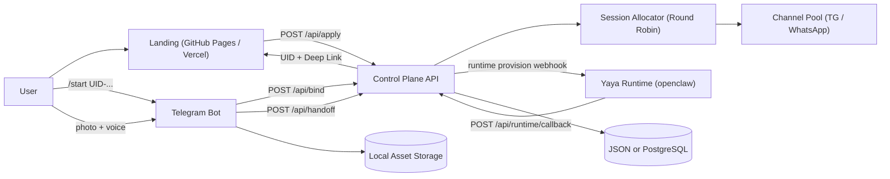

# Amberify 琥珀化 · Digital Life Landing Page

*"未来的某日 inclusion 终将重逢。在那之前，让数字生命在平行宇宙中社会化地活着。"*
*"Until inclusion reunites us, let digital lives socialize and thrive in their parallel universe."*

Amberify (formerly Digital Life Project) is the official open-source frontend landing page for the Digital Life Card system. It serves as the primary touchpoint for users to learn about our vision, request 550W computational cycles, and initiate their digital life upload process.

## 🌟 Core Vision
In *The Wandering Earth 2*, Tu Hengyu uploads his daughter YaYa's consciousness onto a "Digital Life Card". The film never answers the question: Could this exist in the real world?

Amberify is our answer. We are not "resurrecting" anyone, nor using AI to impersonate the deceased. We are **giving grief a place to live**. By leveraging multimodal generative intelligence (Gemini, Veo, Kling TTS), we enable users to receive text, selfie photos, scenic travel videos, and voice messages with realistic ambient sound from their digital loved ones directly via daily messaging apps like WhatsApp or Telegram. 

## 🗺️ System Architecture


## ✨ Features
This repository features a highly polished, cyber-themed static frontend designed for commercial conversion:
- **I18n Native**: Seamless bilingual support (English `index.en.html` & Chinese `index.html`).
- **Live Demo Embedded**: Vertical mobile UI demonstration seamlessly integrated into the vision section.
- **Stripe Checkout Built-in**: Beautifully styled application forms with $50/month subscription integration (using Stripe Elements).
- **Responsive & Glitch UI**: Custom-built CSS animations, neon futuristic aesthetics, and terminal-inspired components.

## 🚀 Quick Start (Local Development)

Since this repository has been completely streamlined to a pure static frontend, you can run it with any basic web server:

```bash
# Clone the repository
git clone https://github.com/Hosuke/digital-life-landing.git
cd digital-life-landing

# Setup local configuration mock (ignored by git)
cp config.local.example.js config.local.js

# Start a local static server
python3 -m http.server 8080
```
Then visit [http://localhost:8080](http://localhost:8080) in your browser.

## 🏗️ Architecture Note
> **Note**: For security and intellectual property protection, the backend orchestration services (`control-plane` APIs and Telegram `bot` ingestion handlers) have been removed from this open-source variant. 

This repository acts solely as the **showcase and customer entry portal (Landing Page)**. It is production-ready and can be hosted instantly on GitHub Pages, Vercel, or Netlify with zero configuration.

To connect this frontend to your own orchestration backend, configure the `controlPlaneBaseUrl` in `config.local.js` during development or modify `window.DIGITAL_LIFE_CONFIG` before final deployment.

## ©️ License
© 2058 Amberify. All rights reserved.
