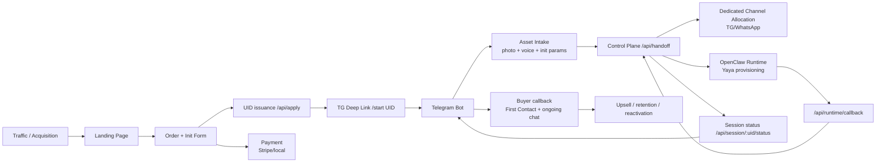

# Multi-System Integration Blueprint (User Entry -> OpenClaw Init -> Buyer Callback)

中文版: [SYSTEM_INTEGRATION.zh-CN.md](./SYSTEM_INTEGRATION.zh-CN.md)

## 1. Scope and Objective
This document defines the cross-system closed loop for the Digital Life experience:
- User entry (Landing / order / payment)
- UID binding and init data intake (Telegram Bot)
- Orchestration and routing (Control Plane)
- Yaya instantiation (OpenClaw Runtime)
- Buyer callback and continuous conversation (TG/WhatsApp)

To keep investor and PM communication accurate, each section marks:
- `Implemented`: available in current repo
- `Planned`: next-phase extension

## 2. Macro Architecture

## 3. Responsibility Split
- Landing (frontdoor)
  - Responsibility: acquisition, basic form, UID creation, deep-link handoff
  - Status: `Implemented` (UID creation)
  - Gap: `Planned` (frontend payment integration and risk checks); `Implemented` (backend payment gate + payment status update API)
- Telegram Bot (experience gateway)
  - Responsibility: UID bind, asset collection, progress feedback
  - Status: `Implemented`
- Control Plane (orchestration hub)
  - Responsibility: state machine, channel allocation, runtime callback persistence
  - Status: `Implemented`
- OpenClaw Runtime (execution layer)
  - Responsibility: per-UID runtime bootstrap, persona/memory initialization, return entrypoint
  - Status: `Implemented at API integration layer` (webhook + callback); business capability evolves in runtime repo
- Channel Pool
  - Responsibility: round-robin assignment of dedicated conversation resources
  - Status: `Implemented`

## 4. End-to-End Flow (Interaction-Level)
1. User enters landing and submits intent + basic profile.
2. Landing calls `POST /api/apply` and gets a unique UID (`UID-550W-XXXXXX`).
3. Payment service callback updates order payment state via `POST /api/payment/webhook/stripe` (signature verified), or manual ops can patch via `POST /api/order/payment`.
4. Landing can refresh payment state via `statusUrl`; when state becomes `paid/waived`, Telegram deep link is unlocked.
5. UI shows UID + deep link to Telegram bot.
6. Bot receives `/start UID-...` and calls `POST /api/bind` with `uid + chatId`.
7. Bot asks for initialization assets (>=1 photo + >=10s voice).
8. Once validated, bot calls `POST /api/handoff`.
9. Control Plane does two things in parallel:
- allocate dedicated channel from pool (TG/WhatsApp/virtual fallback)
- trigger OpenClaw runtime provisioning (`none` or `webhook` mode)
10. If runtime responds `ready` synchronously, session moves to `active` immediately.
11. If runtime responds `provisioning`, bot polls `GET /api/session/:uid/status`.
12. OpenClaw posts async result to `POST /api/runtime/callback` (`ready/failed`).
13. Bot proactively informs the buyer that initialization is complete and sends First Contact.
14. Conversation continues until upsell thresholds trigger paid lifecycle flow.

## 5. State Model
- Order state (recommended)
  - `created -> payment_pending -> paid -> refunded/canceled`
- Session state (`Implemented`)
  - `created -> bound -> handoff_pending -> allocated -> active`
- Runtime state (`Implemented`)
  - `queued/provisioning -> ready` or `failed`

Recommended constraints:
- Only `paid` (or allowlisted trial) orders can enter handoff.
- On `runtime=failed`, bot degrades gracefully to same-chat mode and opens retry task.

## 6. Buyer Callback Behavior
- First Contact trigger
  - `runtime.ready` and asset validation passed
- Message pacing guideline
  - First sentence: no extra delay after model output
  - Following sentences: delay with `1x typing speed` (chars / cps with min/max clamp)
  - Status: `Implemented` for bot active-chat replies
- Practical note
  - Telegram network/client latency still affects visible timing
  - If stronger rhythm is required, enforce a server-side minimum delay (for example 1.2s)

## 7. Media Strategy (Avoid Unstable Live Generation)
- Image: inventory rotation (1..N, then loop)
- Video: pre-generated inventory, not live generation in conversation
- Video style constraints (product requirement)
  - rear-camera vlog style
  - no visible Yaya character in frame (stability and consistency)
- Fallback
  - if inventory fails, respond with text/voice and keep funnel moving

## 8. Key API Contracts
- `POST /api/apply`
  - in: applicant/relation/message/plan
  - out: `uid`, `deepLink`, `orderId`
- `POST /api/bind`
  - in: `uid`, `chatId`, `platform`
- `POST /api/handoff`
  - in: `uid`, `assetSummary`
  - out: `assignment`, `runtime`
- `POST /api/runtime/callback`
  - in: `uid`, `runtime.status`, `entrypoint`, `meta`

## 9. Deployment and Hosting Checklist
- Required
  - static hosting (GitHub Pages / Vercel)
  - Node service (Control Plane)
  - long-running Node process (Bot)
  - PostgreSQL (recommended for production)
- Recommended
  - Redis + queue for async retries
  - object storage for media archive
  - observability stack (Sentry + logs + metrics)

## 10. PM/Investor Narrative Order
- Story first: from "UID awakening" to first emotional contact
- Mechanism second: why the loop is scalable and measurable
- Economics third: Trial->Paid, retention, LTV/CAC, and cost structure

## 11. Relationship to Existing Docs
- This file is the macro integration view (product + architecture + operations)
- For implementation details, see:
  - [ARCHITECTURE.en.md](../ARCHITECTURE.en.md)
  - [docs/ORCHESTRATION_RUNBOOK.en.md](./ORCHESTRATION_RUNBOOK.en.md)
  - [docs/USER_JOURNEY_MAP.en.md](./USER_JOURNEY_MAP.en.md)
