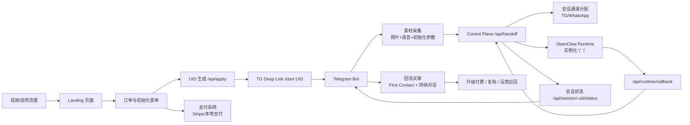

# 多系统整合总览（用户入口 -> OpenClaw 初始化 -> 买家回流）

English version: [SYSTEM_INTEGRATION.en.md](./SYSTEM_INTEGRATION.en.md)

## 1. 目标与边界
本文件描述 Digital Life 体验版的跨系统闭环：
- 用户入口（Landing / 下单 / 付款）
- UID 绑定与初始化资料采集（Telegram Bot）
- 任务编排与分配（Control Plane）
- 丫丫实例化（OpenClaw Runtime）
- 初始化完成后的买家回流与持续交互（TG/WhatsApp）

为避免误解，文档中的流程分为两类：
- `已实现`：当前仓库已具备可运行实现
- `规划中`：建议下一阶段补齐

## 2. 系统全景（宏观）

## 3. 系统职责拆分
- Landing（前端入口）
  - 职责：获客、收集基础信息、发起 UID、触发 Deep Link
  - 状态：`已实现`（UID 创建）
  - 待补：`规划中`（前端支付接入与风控）；`已实现`（后端支付门禁与支付状态更新接口）
- Telegram Bot（体验交互入口）
  - 职责：绑定 UID、采集素材、给用户进度反馈
  - 状态：`已实现`
- Control Plane（编排中枢）
  - 职责：订单与会话状态机、渠道分配、运行时回调落库
  - 状态：`已实现`
- OpenClaw Runtime（丫丫实例化执行层）
  - 职责：按 UID 启动独立实例、加载初始人设/记忆、返回可用入口
  - 状态：`已实现接口对接`（webhook + callback）；具体业务能力按 runtime 项目迭代
- Channel Pool（独立会话池）
  - 职责：按 round-robin 分配独立对话资源
  - 状态：`已实现`

## 4. 端到端流程（含交互细节）
1. 用户进入 Landing，填写基础信息与体验诉求。  
2. Landing 调用 `POST /api/apply`，生成唯一 UID（例如 `UID-550W-XXXXXX`）。  
3. 支付系统回调通过 `POST /api/payment/webhook/stripe`（签名校验）或人工补单 `POST /api/order/payment` 更新订单支付状态。  
4. Landing 可通过 `statusUrl` 刷新订单支付态；当状态为 `paid/waived` 后放行 TG Deep Link。  
5. 页面展示 UID + Deep Link，用户点击跳转 TG Bot。  
6. Bot 收到 `/start UID-...`，调用 `POST /api/bind` 绑定 `uid + chatId`。  
7. Bot 引导用户上传初始化素材（至少 1 张照片 + 至少 10 秒语音）。  
8. 素材满足条件后，Bot 调用 `POST /api/handoff`。  
9. Control Plane 执行两件事：
- 分配独立会话通道（Telegram/WhatsApp/virtual fallback）
- 触发 OpenClaw Runtime 实例化（`none` 或 `webhook` 模式）
10. 若 runtime 同步返回 `ready`，会话立即进入 `active`。  
11. 若 runtime 返回 `provisioning`，Bot 轮询 `GET /api/session/:uid/status`，等待 callback。  
12. OpenClaw 通过 `POST /api/runtime/callback` 写回 `ready/failed`。  
13. Bot 主动通知买家“初始化完成”，发送 First Contact（文本/语音/视频），进入持续交互。  
14. 达到体验阈值后触发升级漏斗（订阅、套餐、复购）。

## 5. 状态机（订单 + 会话 + 运行时）
- 订单态（建议）
  - `created -> payment_pending -> paid -> refunded/canceled`
- 会话态（已实现）
  - `created -> bound -> handoff_pending -> allocated -> active`
- 运行时态（已实现）
  - `queued/provisioning -> ready` 或 `failed`

推荐约束：
- 只有 `paid`（或试用白名单）订单可进入 `handoff`。
- `runtime=failed` 时，Bot 自动降级到同窗口继续体验，并触发重试任务。

## 6. 买家回流策略（消息层）
- First Contact 触发条件
  - `runtime.ready` 且素材校验通过
- 发送节奏（建议与当前实现口径）
  - 第一句：不额外计时，模型返回后可直接发出
  - 后续句：按 `1x 打字速度` 延迟发送（字符数 / cps，设置最小与最大等待）
  - 状态：`已实现`（bot active 对话回复节奏）
- 注意事项
  - 真实展示会受 Telegram 网络与客户端渲染延迟影响
  - 若需要“明显间隔感”，应在服务端强制最小延迟阈值（如 1.2s）

## 7. 媒资策略（避免现场生成不稳定）
- 图片策略：库存池循环（1..N 用完后回到 1）
- 视频策略：预生成库存，避免对话现场生成
- 视频风格约束（产品要求）
  - 使用后置摄像头 vlog 视角
  - 画面中不出现“丫丫本人”以降低人物一致性风险
- 失败兜底
  - 库存不足或异常时，回退到文本/语音回复，不阻断主流程

## 8. API 与数据契约（关键字段）
- `POST /api/apply`
  - 输入：用户基础信息、关系、留言、计划类型
  - 输出：`uid`, `deepLink`, `orderId`
- `POST /api/bind`
  - 输入：`uid`, `chatId`, `platform`
- `POST /api/handoff`
  - 输入：`uid`, `assetSummary`
  - 输出：`assignment`, `runtime`
- `POST /api/runtime/callback`
  - 输入：`uid`, `runtime.status`, `entrypoint`, `meta`

## 9. 部署与资源清单（落地主机）
- 必需服务
  - 静态站托管（GitHub Pages / Vercel）
  - Node 服务（Control Plane）
  - Node 常驻进程（Bot）
  - PostgreSQL（生产建议）
- 推荐补充
  - Redis + 队列（异步任务与重试）
  - 对象存储（素材归档）
  - 可观测性（Sentry + 日志 + 指标）

## 10. 对投资人与产品经理的表达建议
- 先讲故事：从“UID 唤醒”到“首次通话”形成情绪峰值
- 再讲机制：为什么这条链路可规模化、可监控、可优化
- 最后讲生意：Trial->Paid、留存、LTV/CAC 与成本结构

## 11. 与现有文档的关系
- 本文档是跨系统总览（产品 + 架构 + 运营串联）
- 细节继续参考：
  - [ARCHITECTURE.md](../ARCHITECTURE.md)
  - [docs/ORCHESTRATION_RUNBOOK.zh-CN.md](./ORCHESTRATION_RUNBOOK.zh-CN.md)
  - [docs/USER_JOURNEY_MAP.zh-CN.md](./USER_JOURNEY_MAP.zh-CN.md)
